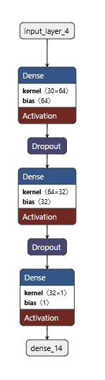

# Deep_learning_R

A compact, end-to-end example of building, evaluating, and exporting a neural network that classifies breast tumors as malignant (1) or benign (0). The project demonstrates both R-native Keras and Python tf.keras via reticulate, with reproducible preprocessing and mobile deployment through TensorFlow Lite.

# What this repo contains

- [Deep_Learning_R.Rmd](https://github.com/Fausford/Deep_learning_R/blob/main/Deep_Learning_R.Rmd)

R Markdown notebook with the full pipeline in R (data prep, split, scaling, model build, training, evaluation, ROC).

- [Python_Source_code.Rmd](https://github.com/Fausford/Deep_learning_R/blob/main/Python_Source_code.Rmd)

R Markdown showing the Python workflow executed from R via reticulate.

- [model.py](https://github.com/Fausford/Deep_learning_R/blob/main/model.py)

Standalone Python script version of the training pipeline.

- [cancer.csv](https://github.com/Fausford/Deep_learning_R/blob/main/cancer.csv) 

Input dataset. Target column is diagnosis(1=m, 0=b); the remaining 30 columns are numeric features.

- **cancer_model.keras / model.keras **

Saved Keras model files (HDF5-style single-file format for tf.keras 3).

- **cancer_drq.tflite** 

TensorFlow Lite model with dynamic-range quantization for deployment on CPUs/mobile.

- Model_netron.png 

Model architecture diagram exported from Netron.

# Problem & approach

Task

Binary classification (malignant vs. benign) using tabular features from the Wisconsin Diagnostic Breast Cancer dataset (schema mirrored in cancer.csv).

Preprocessing

Train/test split with stratification, feature standardization using training statistics only.

Model

Small multilayer perceptron (ReLU hidden layers with dropout, sigmoid output). Trained with binary cross-entropy, Adam optimizer, and metrics including accuracy and AUC. Early stopping prevents overfitting.

## Deployment

The trained model is exported to:

Keras single-file format (.keras) for reuse and visualization.

TensorFlow Lite (.tflite) with dynamic-range quantization for smaller size and faster inference on edge devices.

## Getting started

Clone the repository and open it in RStudio (or your preferred IDE).

Open Deep_Learning_R.Rmd to run the end-to-end R workflow.

Optionally open Python_Source_code.Rmd or model.py to see or run the Python version via reticulate.

Inspect outputs:

Evaluation metrics printed in the notebook/script (accuracy, AUC, confusion matrix).

Saved models: .keras and .tflite files in the project root.

Architecture visualization in Model_netron.png.

### Data

File: cancer.csv

Target: diagnosis(1=m, 0=b) — 1 indicates malignant, 0 benign.

Features: 30 standardized numeric descriptors (radius, texture, perimeter, area, smoothness, compactness, concavity, concave points, symmetry, fractal dimension, plus “_se” and “_worst” variants).

**Note**: Features are standardized using statistics computed from the training split only to avoid leakage.

### Results (typical)

With an 80/20 stratified split and early stopping, the model commonly achieves high accuracy and ROC AUC on the held-out test set. Actual numbers vary by split and seed. Use the notebooks to reproduce exact metrics and plots.

## Requirements

R: R 4.x with packages: keras, reticulate, tidyverse, caret, pROC, knitr.

Python (via reticulate): Python 3.10 with TensorFlow, scikit-learn, NumPy, pandas.
For plotting and diagrams, matplotlib, pydot, and Graphviz may be needed.

Hardware: CPU-only is sufficient. GPU is optional and not required.

# Model visualization

 Open cancer_model.keras or model.keras in Netron to explore layers and shapes; Model_netron.png provides a snapshot.

TensorFlow Lite export
cancer_drq.tflite demonstrates dynamic-range quantization for smaller model size and faster CPU inference.

When deploying, remember to replicate the training-time feature scaling on inputs before inference.

# Reproducibility
Random seeds are set in the notebooks to make splits and training behavior repeatable, within the limits of backend nondeterminism.

Limitations & ethics
This project is for educational and research purposes only.
It is not a medical device and must not be used for clinical decision making without proper validation and regulatory review.

# Acknowledgments

Wisconsin Diagnostic Breast Cancer dataset (schema mirrored in cancer.csv).

TensorFlow/Keras and scikit-learn communities for tools and documentation.